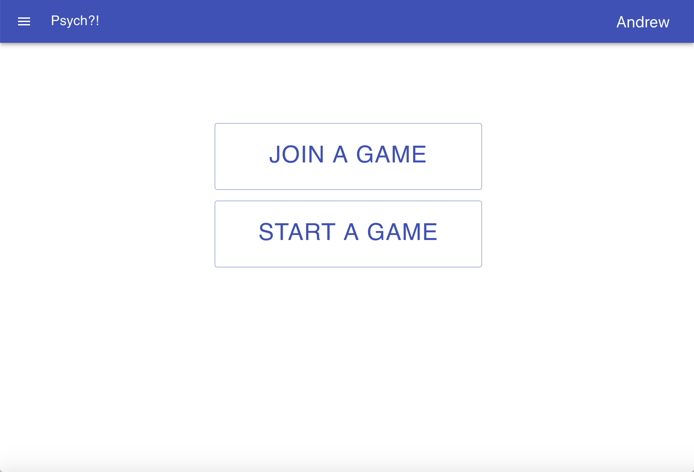
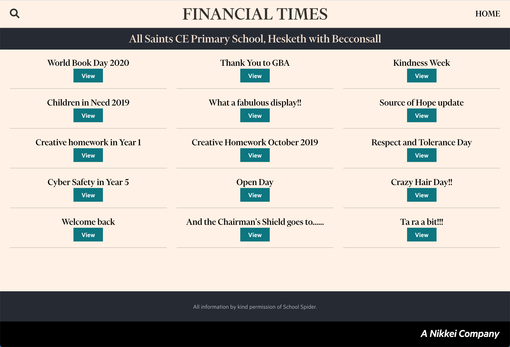
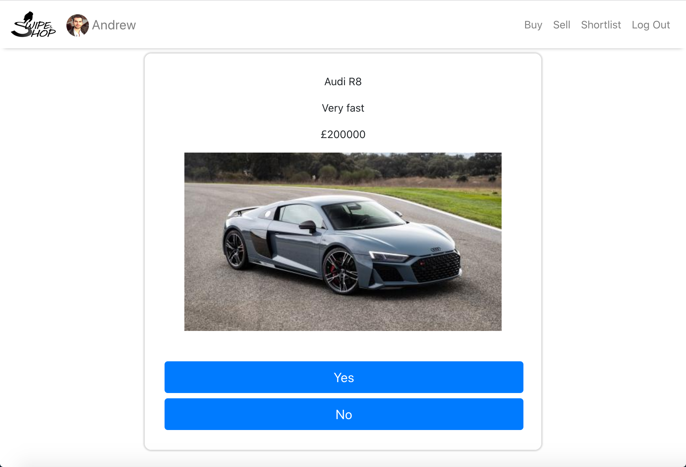
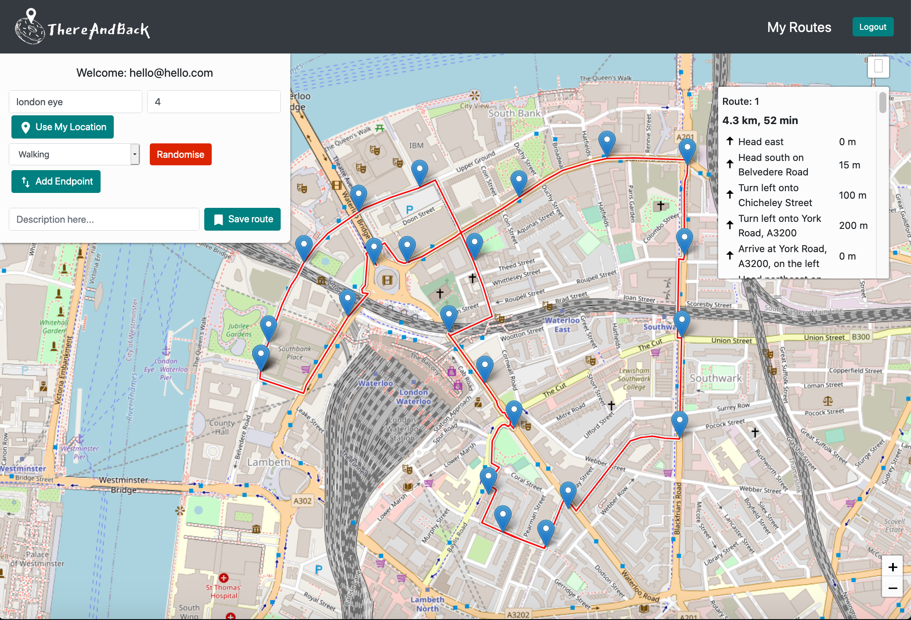
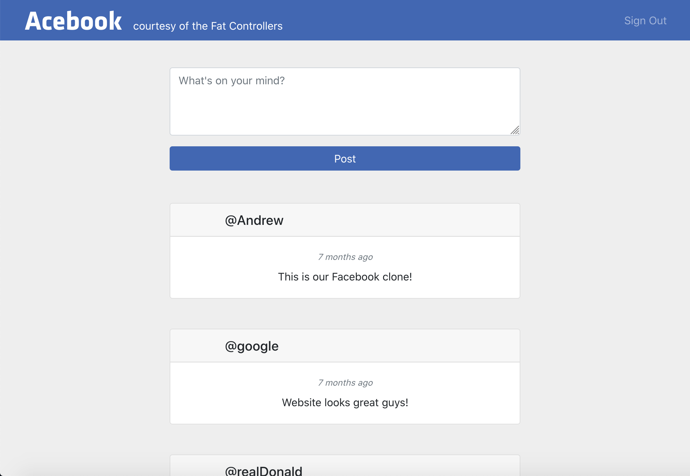
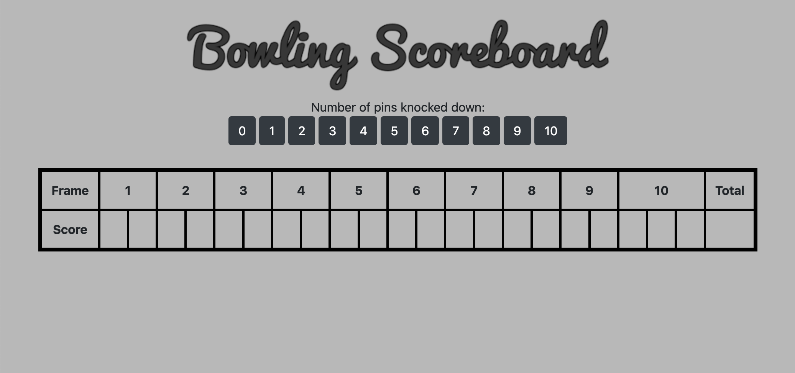
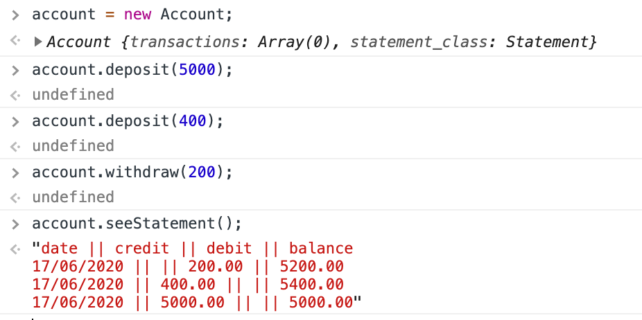

### About Me

A full-stack developer trained at Makers Academy specialising in JavaScript and React.

Previously graduated with a Master's in Mechanical Engineering from the University of Bristol, and worked in engineering consultancies, including Ramboll, for over 3 years.

Currently working part-time developing the front-end website for a music company, building 2 full-stack projects, and regularly attending meetups e.g. 'React London' and 'Migrating Waitrose.com to React'. 

### Tech Stack
- Languages: JavaScript, TypeScript, Ruby, SQL, GraphQL, MATLAB, HTML/CSS
- Technologies: React, Redux, Node.js, Ruby on Rails, jQuery, npm, Express.js, Sinatra, Bootstrap, Tailwind CSS, Material-UI, AWS (S3, Cloud9)
- Testing: Cypress, Jest, Enzyme, Jasmine, RSpec, Capybara 
- Databases: PostgreSQL, MongoDB, Firebase
- DevOps: Travis CI, Heroku, Surge, Docker
- Version Control: GitHub

### Key Projects

| Project | Description | Links | Technologies | Image |
|:-:        |:-:          |:-:   |:-:           |:-:           |
| Psych | Current work in progress. Full-stack application based on the game 'Cards Against Humanity'. Group project of two team members. | [GitHub](https://github.com/AndrewHulme/Psych) | React, TypeScript, Redux, GraphQL, Ruby on Rails, Cypress, Jest/Enzyme, RSpec, React Router, Docker, Material-UI, HTML, CSS |  |
| Financial Times | Front-end application which displays news items for schools represented by School Spider. Solo project. | [Deployed](https://sstechtest.herokuapp.com/schools)   [GitHub](https://github.com/AndrewHulme/SSTechTest) | React, Cypress, Jest/Enzyme, Origami Components, React Router, React Image Lightbox, HTML, CSS |  |
| Swipe and Shop | Current work in progress. Full-stack application used to buy and sell items in a 'Tinder' style. Group project of three team members. | [Deployed](https://swipe-and-shop.herokuapp.com/)   [GitHub](https://github.com/GarethWoodman/swipe_and_shop) | React, Node.js, MongoDB, Express.js, JavaScript, Mongoose, Cypress, Bootstrap, HTML, CSS |  |
| ThereAndBack | Full-stack lockdown inspired application used to generate circular routes for a given distance and starting location. Group project of four team members. | [Deployed](https://thereandback.surge.sh/)   [GitHub](https://github.com/AndrewHulme/route_planner)   [Presentation (4 minute mark)](https://lnkd.in/dk9HyWh) | React, Firebase, Cypress, Istanbul, Leaflet, Location IQ API, Open Route Service API, GraphHopper API, Bootstrap, HTML, CSS |  |
| Acebook | Full-stack application which is a simplified duplicate of the social media site 'Facebook'. Group project of six team members. | [Deployed](http://acebook.surge.sh)   [GitHub](https://github.com/AndrewHulme/acebook-the-fat-controllers-frontend) | React, Ruby on Rails, PostgreSQL, Cypress, RSpec, Capybara, Bootstrap, HTML, CSS |  |
| Bowling Scorecard | A dynamic bowling scorecard based on the classic coding kata. Solo project. | [Deployed](https://andrewhulme.github.io/bowling-challenge/)   [GitHub](https://github.com/AndrewHulme/bowling-challenge) | JavaScript, jQuery, Jasmine, Bootstrap, HTML, CSS |  |
| Bank Tech Test | Allows users to interact with their bank account by using the console to deposit money, withdraw money and print their bank statement. Solo project. | [GitHub](https://github.com/AndrewHulme/BankTechTest) | JavaScript, Jasmine |  |

<!-- <h3> More About Me </h3>

- 💻 &nbsp; JavaScript/React/Redux/Node.js/Express.js | Ruby/Ruby on Rails | MongoDB/PostgreSQL/Firebase  
- 🧪 &nbsp; Cypress/Jasmine/RSpec/Capybara
- 🎓 &nbsp; MEng Mechanical Engineering from University of Bristol | Graduate of Makers Academy Bootcamp
- 💼 &nbsp; Previous work experience in engineering consultancies as a Mechanical Engineer for over 3 years
- 👥 &nbsp; Regularly attend React/coding meetups to network and keep up-to-date with recent trends and projects
- ♥️  &nbsp; Interests in music, travelling, cycling and volunteering
- 👉 &nbsp; Take a look at my [CV](https://github.com/AndrewHulme/CV) for full tech stack and to browse some of my projects  -->

<!--
**AndrewHulme/AndrewHulme** is a ✨ _special_ ✨ repository because its `README.md` (this file) appears on your GitHub profile.

Here are some ideas to get you started:

- 🔭 I’m currently working on ...
- 🌱 I’m currently learning ...
- 👯 I’m looking to collaborate on ...
- 🤔 I’m looking for help with ...
- 💬 Ask me about ...
- 📫 How to reach me: ...
- 😄 Pronouns: ...
- ⚡ Fun fact: ...
-->
